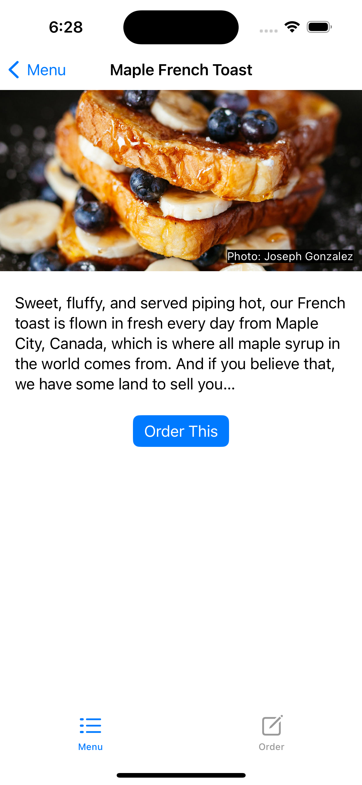

# StMenu

Thanks to Paul Hudson HackingWithSwift training, I am sharing this project with you.

 

 

 

 

 

 

 

<h3>Paul Hudson</h3> 
https://www.hackingwithswift.com
 
<h3>Efe Soydas</h3>
 
https://www.linkedin.com/in/efesydss/
 
